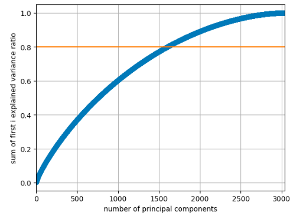
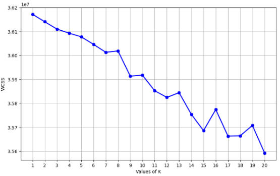

# Sentiment Analysis on tweets related to the COVID-19
final project for the course "Applied Machine Learning"

## 1. Dataset Description

The dataset comprises 3798 manually tagged tweets extracted from Twitter. Sentiment labels include “Negative” (1633 tweets), “Neutral” (619 tweets), and “Positive” (1546 tweets). After TF-IDF vectorization, the dataset contains 9524 features. The dataset is in CSV format and is publicly accessible.

## 2. Problem Statement

### 2.1 The Problems
1.  **Classification**: To classify 3798 data points, each with 9524 features, into three sentiment groups: positive, negative, and neutral.
2.  **Clustering**: To group the same 3798 data points with 9524 features into multiple clusters.

### 2.2 Evaluation Metrics
For classification, balanced accuracy score was used due to the dataset's imbalanced distribution. This metric, calculated as (True Positive + True Negative)/2, ranges from 0 (random classification) to 1 (perfect classification). True Positive represents the ratio of correctly predicted positive observations to total actual positives, while True Negative represents the ratio of correctly predicted negative observations to total actual negatives.

For clustering, the Rand Index initially compared K-Means results with original manual labels. Additionally, word clouds and centroid representative words were analyzed intuitively. Effective clustering was indicated by clear, distinct patterns in word clouds with relevant and representative words for each cluster's underlying themes.

## 3. Main Section

This project explores two main approaches:
* **Classification**: Employing three linear and three nonlinear models for Problem 1.
* **Clustering**: Utilizing the K-Means model for Problem 2.

### 3.1 Classification Method

To classify the 3798 data points into sentiment groups, a supervised machine learning classification method was used, ideal for this sentiment analysis task.

**Data Preprocessing:**
1.  URLs, HTML tags, and @names were removed, creating a "cleaned_text" column.
2.  `LabelEncoder` converted categorical labels to numerical values.
3.  The data was split into training and test sets (80/20 ratio).
4.  TF-IDF vectorization transformed text data into vectorized input.
5.  Further input data preprocessing involved three methods:
    * **Standardization**: `StandardScaler` was applied to training and test data, resulting in 9524 features.
    * **PCA (Principal Component Analysis)**: After standardization, PCA reduced features to 1600. The number of components was chosen by setting an explained variance ratio threshold at 0.8.

    PCA Explained Variance Ratio Plot: 

    * **ANOVA (Analysis of Variance)**: Applied to original input data to reduce features to 1600, enabling a meaningful comparison with PCA. Data standardization using `StandardScaler` was also performed after ANOVA.

### 3.1.1 Linear and Nonlinear Classification Models
For this multi-class classification, the One-vs-Rest (OvR) method was chosen over One-vs-One (OvO) due to similar performance but faster execution. OvR was applied to:

* **Logistic Regression**: A linear binary classifier.
* **Perceptron**: A linear binary classifier.
* **Linear SVC**: A Support Vector Machine (SVM) that finds an optimal decision boundary. The regularization parameter 'C' was tuned to 0.01 using Grid Search CV.
* **K-Nearest Neighbors (kNN)**: A nonlinear multiclass algorithm that classifies based on neighbors. The number of nearest neighbors, K, was tuned using Grid Search CV.
* **Kernel SVC**: Similar to Linear SVC, but employs kernel tricks for non-linear decision boundaries. The best kernel function (linear, polynomial, radial basis function (rbf), sigmoid) and regularization parameter 'C' were selected.
* **Decision Tree**: A hierarchical, tree-like supervised algorithm for classification. Impurity function choice and regularization for terminal nodes were tuned using Grid Search CV.

### 3.1.2 Results and Discussions
The optimal hyperparameters for four models are:

| Model         | Without PCA                               | With PCA                                   | With ANOVA                                  |
| :------------ | :---------------------------------------- | :----------------------------------------- | :------------------------------------------ |
| Linear SVC    | `{'C':0.01}`                              | `{'C': 0.01}`                              | `{'C': 0.01}`                               |
| Kernel SVC    | `"{'C': 0.1, 'kernel': 'linear'}"`        | `"{'C': 10, 'kernel': 'rbf'}"`             | `"{'C': 1, 'kernel': 'rbf'}"`               |
| kNN           | `k=301`                                   | `k=801`                                    | `k=1`                                       |
| Decision Tree | `"{'ccp_alpha': 0.001, 'criterion': 'gini'}"` | `"{'ccp_alpha': 0.004, 'criterion': 'gini'}"` | `"{'ccp_alpha': 0.001, 'criterion': 'gini'}"`

The training and test accuracies for all six models, comparing PCA and ANOVA preprocessed input data, are in the table below.

Classification Results Table: 

**Key Findings:**
Overall classification results were unsatisfactory, with maximum test accuracy around 0.55. This is attributed to overfitting, the relatively small dataset size (3798 data points insufficient for 9524 features), potential discrepancies between training and test data, and the dataset's inherent imbalance. Concerns also arose regarding the accuracy of manual labeling.

Non-linear classifiers (Decision Tree, Kernel SVC, kNN) generally performed slightly better than linear ones. PCA decreased training accuracy for all models but improved balanced test accuracy for Perceptron and Linear SVC, while reducing it for Decision Tree and Kernel SVC. ANOVA further decreased training accuracy for all models except kNN. Test accuracy scores with ANOVA were generally higher than with PCA, excluding Perceptron and Kernel SVC.

### 3.2 Clustering Method
To group the 3798 data points into clusters, the unsupervised K-Means clustering method was employed.

**Data Preprocessing:**
1.  URLs, HTML tags, and @names were removed, creating a "cleaned_text" column.
2.  TF-IDF vectorization transformed texts into vectorized input.
3.  Three preprocessing approaches were explored:
    * **PCA**: Standardized input data was reduced to 1600 features using PCA based on a threshold plot. Initial clustering results were unsatisfactory due to highly imbalanced cluster sizes.
    * **Standardization Only**: Only standardization was applied, leaving 9524 features. This slightly improved results, but clusters remained highly imbalanced.
    * **ANOVA**: Input features were reduced to 1600 using ANOVA, followed by data standardization. This method significantly improved clustering.

### 3.2.1 K-Means Model
K-Means clustering, a centroid-based algorithm, partitions data points into K clusters based on Euclidean distance. The number of clusters (K) was the primary parameter tuned. K=3 was initially chosen for comparison with sentiment classification. The elbow method, plotting within-cluster sum of squares (WCSS) against K, identified an optimal K.

### 3.2.2 Results and Discussions
### 3.2.2.1 Input data pre-processed with PCA
Under PCA preprocessing, no clear "elbow" was observed in the WCSS plot within the [1,20] range, suggesting it might be beyond this range. Due to practical constraints, only K=3 was tested.

WCSS vs. K Plot (PCA): 

With K=3, the Rand Index was 0.3771580152, indicating dissimilarity from the sentiment classification. Word clouds and centroid representatives were then examined.

Cluster 0 Word Cloud (PCA): 
Cluster 1 Word Cloud (PCA): 
Cluster 2 Word Cloud (PCA): 

Centroid Examples (K=3, with PCA):
Centroid 1: What is this creature?
Centroid 2: Infected > 110,000 people At least 110 countries > 4,000 people have died Declining oil prices Stock market rout Lower bond yields #sensex #StockMarketCrash2020 #nifty #Covid_19 #CoronavirusPandemic #coronavirusinindia Ye Mumbai ki upper class families ko sab kuch hoard karne ka kya shauk hai?
Centroid 3: Local grocery stores as well as Bigbasket running out of the very basic food items (includes bread and eggs) is my first personal real panic since covid-19 hit

Word cloud generation showed issues; Clusters 0 and 2 had significantly fewer words than Cluster 1, despite a top 100 limit, due to only 1 data point in each of the former. This imbalance was attributed to inherent data distribution, random centroid initialization, and a non-optimal K value. Attempts to resolve this by removing PCA or changing centroid initialization were unsuccessful. Preprocessing with ANOVA ultimately improved the result. The second condition (standardization only) yielded poor clustering with highly imbalanced clusters, limiting further exploration.

### 3.2.2.2 Input data pre-processed with ANOVA
With ANOVA preprocessing, an "elbow" was found at K=9. Both K=3 and K=9 were tested.

WCSS vs. K Plot (ANOVA): 

When K=3, the Rand Index was 0.4659523753058559, which, while not good, did not fully reflect clustering quality. Cluster sizes became more balanced: Cluster 0: 2963 data points; Cluster 1: 787 data points; Cluster 2: 48 data points. Given the dataset's inherent imbalance, no forced equalization of cluster sizes was applied. Word clouds and centroid representatives were then examined for meaning.

Cluster 1 Word Cloud (ANOVA, K=3): 
Cluster 2 Word Cloud (ANOVA, K=3): 
Cluster 3 Word Cloud (ANOVA, K=3): 

Centroid Examples (K=3, with ANOVA):
Centroid 1: Stock up on Food & Water asap before the forced quarantines for the deadly CoronaVirus. covid-19 covid19 stocks bonds silver gold slv gld intern nurse rn medstudent paramedic trucker patriot taxi prepper veteran hunter biker surfer bartender e3 eos bch xrp
Centroid 2: Yeah. I've seen eggs, milk & Lysol wipes being sold out at grocery store due 2 #Covid_19. Folks have gone nuts 2 & they need 2 calm down. This isn't the black plague.
Centroid 3: Nice long pause there. #douchebag #pricegouger At this point donating it to nursing homes,small biz, shelters, grocery store workers would probably be the right thing to do. Or I don’t know, maybe try to sell it for normal prices to recoup some $. #coronapocalypse #coronavirus

When K=9, cluster sizes became more balanced: Cluster 0: 33 data points; Cluster 1: 39 data points; Cluster 2: 12 data points; Cluster 3: 486 data points; Cluster 4: 2663 data points; Cluster 5: 30 data points; Cluster 6: 411 data points; Cluster 7: 71 data points; Cluster 8: 53 data points. Word clouds and centroid representatives were generated to understand each cluster's meaning.

Centroid Examples (K=9, with ANOVA):
Centroid 1: Worried about coronavirus? You want to stock your pantry? Check out this guide about healthy #non_perishable_food. #CoronavirusPandemic #Covid_19 #non_perishable_foods_list #survival_food #non_perishables #non_expiring_food #emergency_food
Centroid 2: Alright y’all I hope our Melanin prevails but just in case I took some precautions I had some food & water delivered. ????? I’ve had my masks for a month and may have to open soon! ?? #B1 #FBA #CoronavirusUSA #COVID
Centroid 3: Call your Senators. Demand they pass the #FamiliesFirst #coronavirus bill containing: -Free testing -14 days paid sick leave -3 months paid family leave -Expanded unemployment insurance -Food security -Medicaid funds Ask for your senator’s office. (202) 224-3121 #COVID19
Centroid 4: First time in 2 weeks that I have seen loo roll in a supermarket! So I bought a sensible quantity of 12! #CalamityCorona #Covid_19 #ToiletPaperApocalypse #stoppanicking
Centroid 5: Stock up on Food & Water asap before the forced quarantines for the deadly CoronaVirus. covid-19 covid19 stocks bonds silver gold slv gld intern nurse rn medstudent paramedic trucker patriot taxi prepper veteran hunter biker surfer bartender e3 eos bch xrp
Centroid 6: In these difficult times please consider donating to your local #FoodbankFriday As panic buys are causing a lot of shortages. Our Lady of Fatima, pray for us. #Covid_19 #Lent2020
Centroid 7: Real talk though. Am I the only one spending hours a day online shopping for loungewear now that I don't have to get dressed for work or public consumption? #coronapocolypse #COVID19 #coronavirus #QuarantineLife
Centroid 8: “We are disappointed that some sellers are attempting to artificially raise prices on basic need products during a global health crisis" #Corona #CoronaVirusUpdate #COVID2019 #handsanitizer
Centroid 9: This weekend take a moment and #thank your #delivery drivers, #supermarket employees, #hospital workers & #pharmacy staff. They’re #stressed out but went to work to #serve you. #AllInThisTogether #Covid_19 #COVID19

Word clouds and centroid representatives provided some unique insights, such as "panic buying," "food shortage," "coronavirus," and "unemployment," reflecting prevalent COVID-19 discussions. However, they were not fully satisfactory in clearly representing each cluster. The raw frequency-based word cloud generation metric may not be ideal for unique word representation. Centroid representatives were clearer but still require further evaluation of their representativeness.

## 4. Conclusion

For sentiment classification, various linear and nonlinear models were explored. Despite using PCA and ANOVA for enhancement, results were generally unsatisfactory due to overfitting, small dataset size, and imbalance. Non-linear classifiers (Decision Tree, Kernel SVC, kNN) performed slightly better, with ANOVA marginally outperforming PCA. The Decision Tree was chosen as the best classifier for both raw and ANOVA-preprocessed input data, based on its highest test accuracy score. For clustering, K-means was applied with K=3 and K=9, generating centroids and word clouds. While these did not consistently imply distinct patterns, they visually indicated trends like panic buying, food shortage, and unemployment. The low Rand Index did not perfectly align with sentiment labels but did not discredit the clusters; understanding underlying narratives is crucial. Future improvements could involve alternative clustering evaluation metrics.